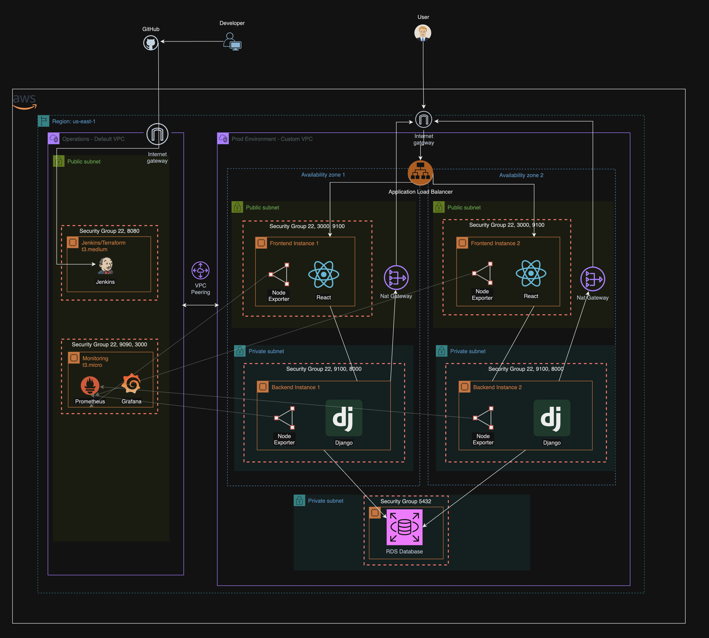
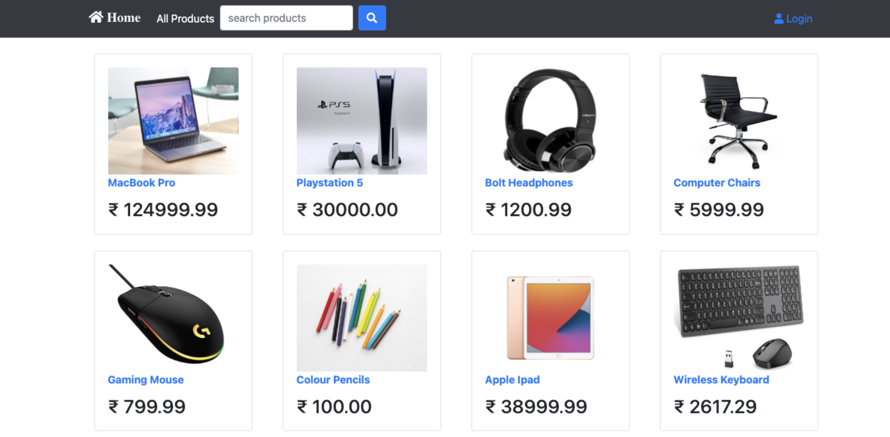

# Kura Labs Cohort 5 - Deployment Workload 5 🚀

## Purpose 🎯

This project was about deplyoing a full-stack eCommerce application using Infrastructure as Code (IaC), specifically with Terraform. The infrastructure is designed to be highly available, secure, and distributed across multiple availability zones in AWS.

## System Design Diagram 📐

## Technologies Used 🛠

- **Frontend**: React.js
- **Backend**: Django/Python
- **Database**: PostgreSQL (RDS)
- **IaC**: Terraform
- **CI/CD**: Jenkins
- **Version Control**: Git/GitHub
- **Cloud Provider**: AWS
- **Monitoring**: Node Exporter

## Steps Taken 📝

### 1. Local Development & Testing

- Created two EC2 instances (Frontend and Backend) to understand deployment requirements
- Configured necessary ports (3000 for Frontend, 8000 for Backend)
- Tested connectivity between components
- Documented required dependencies and configurations

### 2. Infrastructure Setup with Terraform

- Created custom VPC with public and private subnets across two availability zones
- Implemented security groups with precise inbound/outbound rules
- Set up NAT Gateways for private subnet internet access
- Configured Application Load Balancer for frontend traffic distribution
- Established VPC peering for monitoring capabilities
- Created RDS instance in private subnets for database hosting

### 3. Security Implementation

- Placed backend servers in private subnets
- Implemented security groups with principle of least privilege
- Used NAT Gateways for secure outbound internet access
- Protected database access through private subnet placement
- Configured Jenkins credentials management for AWS access

### 4. Database Configuration

- Set up PostgreSQL RDS instance
- Configured database security groups
- Established connectivity between backend servers and RDS
- Implemented database migrations and data loading

## Issues/Troubleshooting 🔧

1. **Jenkins Automation Challenges**

   - Faced difficulties with Jenkins pipeline automation
   - Resolved to manual Terraform deployment as temporary solution
   - Documented pipeline requirements for future implementation

2. **RDS Connectivity**

   - Initial connection issues between backend and RDS
   - Resolved through proper security group configurations
   - Added VPC peering for monitoring access

3. **Frontend-Backend Communication**
   - Had to adjust proxy settings in package.json
   - Modified ALLOWED_HOSTS in Django settings
   - Implemented proper routing through load balancer

## Optimization Suggestions 💡

1. **Infrastructure**

   - Implement auto-scaling groups for dynamic scaling
   - Add CloudFront distribution for static content
   - Consider implementing cache layer (Redis/Elasticache)

2. **Security**

   - Implement WAF for enhanced security
   - Add SSL/TLS certificates for HTTPS
   - Implement AWS Secrets Manager for credential management

3. **Monitoring**
   - Add CloudWatch alarms for resource monitoring
   - Implement ELK stack for log management
   - Set up SNS notifications for critical alerts

## Website

## Conclusion 🎉

While we encountered some challenges with full automation through Jenkins, we successfully deployed a robust, scalable eCommerce infrastructure using Terraform. The architecture follows AWS best practices for high availability and security, with room for future optimizations and enhancements.

The implementation demonstrates the power of Infrastructure as Code while highlighting areas for continued improvement in automation and monitoring capabilities.
